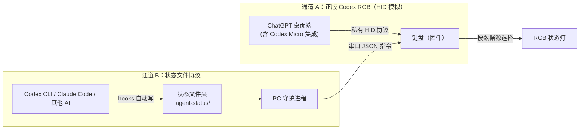

# Codex Micro 平替 · 双通道 RGB 状态键盘 —— 产品需求规格 v0.1

> 状态：草稿待拍板 | 日期：2026-08-06
> 一句话定位：一块能同时兼容"正版 Codex（ChatGPT 桌面端）"和其他 AI 编码 agent（Codex CLI / Claude Code / 其他）的 RGB 状态键盘，物料成本约为原版的 1/3 ~ 1/2。
> 版本概念：本文件 v0.1 = 文档草案版本；**产品 v1 = 第一代可发售版本（只做通道 B）**；产品 v2 = 二代（再加入通道 A 正版兼容）。

---

## 1. 目标用户与卖点

- 重度使用 AI 编码 agent 的开发者（Codex / Claude Code 双修或单修）。
- 想买 Codex Micro 但嫌贵、买不到、或者想要更通用功能的人。
- 核心卖点（对原版的差异优势）：
  1. **双通道**：原版只认 ChatGPT 桌面端；我们通吃 ChatGPT 桌面端 + Codex CLI + Claude Code。
  2. **协议自持**：状态文件协议由我们自己定义，OpenAI 怎么更新都不影响主功能。
  3. **价格**：目标物料成本 100~300 元区间（取决于 v1 裁剪），闲鱼定价可以做到原版 1/3 左右。
- **v1 范围说明（2026-08-06 拍板）**：第一代只做**通道 B（状态文件协议）**；通道 A（正版 HID 兼容）延后到 v2——原因：通道 A 需要 macOS 机器实测，当前没有。

---

## 2. 双通道架构



- **通道 A（兼容原版）**：固件把自己伪装成 Work Louder Codex Micro 的 vendor HID 设备（设备描述 + HID 报告格式与真机一致），ChatGPT 桌面端识别后自动托管 Agent 键状态、命令键重映射、Push-to-talk、推理强度旋钮。参考社区已验证实现：M5Stack Core2 固件（BLE vendor HID）、codex-micro-light（私有 HID 命令）、Stream Deck 模拟器（app 注入法，仅参考，不做）。
- **通道 B（主菜）**：AI agent 通过 hooks 把状态写进本地文件夹，PC 守护进程监听并翻译成 RGB 指令，经串口/自定义 HID 推给键盘。
- 两个通道是**两个独立主控**，同时挂在键盘上，由固件按规则决定谁驱动哪颗灯。

---

## 3. 硬件规格（目标 vs MVP 裁剪）

### 目标配置

| 部件 | 规格 | 说明 |
|---|---|---|
| 按键 | 13 键机械轴 | 6 个 Agent 键 + 7 个命令键 |
| RGB | 每键独立可编程 | WS2812 / SK6812 或灯珠矩阵 |
| 旋转编码器 | 1 个 | 调推理强度 / 自定义 |
| 平面摇杆 | 1 个 | 触发技能 / 自定义宏 |
| 触摸传感器 | 1 个 | 备用交互（手势） |
| 主控 | ESP32-S3 或 RP2040 | 需支持 USB 复合设备 |
| 连接 | USB-C 优先；BLE v2 | USB 最稳，BLE 后补 |
| 外壳 | 3D 打印 / 亚克力 | 不做 CNC，成本优先 |

### v1 MVP 裁剪（建议）

- **砍掉**：摇杆、触摸传感器、BLE（v1 只做 USB）、通道 A（HID 兼容延后 v2）。
- **保留**：13 键 + RGB + 旋转编码器。
- 原因：摇杆/触摸没有对应的开源逆向参考，工作量不可控；编码器相对简单且有现成参考，成本也低（约 10~25 元，此前估算 30~50 元高估了）。

### 3.1 单台成本估算（BOM，5~10 台小批量摊薄）

| 部件 | 单价区间（元） |
|---|---|
| 主控（RP2040 模组） | 10 ~ 25 |
| 机械轴 ×13 | 10 ~ 20 |
| 键帽 ×13 | 15 ~ 40 |
| RGB 灯珠 ×13 | 5 ~ 10 |
| 旋转编码器 + 旋钮帽 | 10 ~ 25 |
| 二极管 / 线材 / 座子等杂项 | 5 ~ 15 |
| 外壳（3D 打印） | 5 ~ 15 |
| PCB（打样摊薄） | 10 ~ 30 |
| **合计** | **70 ~ 180 元/台** |

- 结论：落在预算（50~200 元）内，未超 300 元上限。
- 备注：首台原型若手焊飞线、免 PCB，可压到 70 元上下；外壳自打印则再省 5~15 元。

---

## 4. 通道设计与切换规则

### 4.1 数据源优先级（逐键生效）

1. **Agent 键（1~6）**：默认跟随通道 A（ChatGPT 桌面端）。
2. **超时抢断**：若通道 A 连续 N 秒（默认 5 秒，可配置）没有下发任何状态指令 → 该键自动切换为由通道 B（守护进程）驱动。
3. **自动恢复**：通道 A 恢复下发（桌面端重新连接/打开）→ 切回通道 A。
4. **命令键（7 个）**：
   - 通道 A 激活时：按键语义由 ChatGPT 桌面端通过私有协议分配（接受/拒绝/PTT 等）。
   - 通道 B 激活时：按键语义由固件内置宏（键盘 HID 快捷键）执行，配置由守护进程下发。
5. 固件同时保存两套配置，切换不丢设置。

### 4.2 为什么用"超时抢断"而不是手动切换

- 用户零操作、零学习成本：插上就用，桌面端没开也能亮。
- 天然免疫通道 A 协议失效：桌面端更新导致 HID 失效时，键盘自动变成通道 B，不会变砖。
- 后续可加物理组合键强制切换（如长按某键 3 秒），v1 可不做。

---

## 5. 状态文件协议 v0.1

### 5.1 位置与命名

- Windows：`%USERPROFILE%\.agent-status\`
- macOS/Linux：`~/.agent-status/`
- 每个 agent 一个文件：`agent-1.json` ~ `agent-6.json`（v1 固定 6 个槽位）
- 后续可扩展：按会话 ID 命名、支持无限 agent。

### 5.2 JSON 格式

```json
{
  "state": "running",
  "ts": 1786000000,
  "agent": "codex-1",
  "summary": "fixing bug in parser"
}
```

| 字段 | 必填 | 取值 | 说明 |
|---|---|---|---|
| `state` | 是 | `thinking` / `running` / `waiting` / `done` / `error` / `idle` | 状态机见 5.3 |
| `ts` | 是 | Unix 秒 | 写入时间戳，用于心跳判活 |
| `agent` | 否 | 字符串 | 显示名，v1 可不显示 |
| `summary` | 否 | 字符串 | 当前任务一句话，v1 不显示、仅保留字段 |

### 5.3 状态机与 hooks 映射

| 状态 | 触发时机 | Codex 推荐 hook 事件 |
|---|---|---|
| `thinking` | agent 开始处理用户输入 / 工具调用完成后恢复思考 | `UserPromptSubmit` / `PostToolUse` |
| `running` | 工具/命令即将执行 | `PreToolUse` |
| `waiting` | 需要用户审批/输入 | `PermissionRequest`、`notify`（回合结束） |
| `done` | 任务完成 | `Stop` |
| `error` | 出错终止 | `Stop` + 错误检测（守护进程兜底） |
| `idle` | 会话结束/超时未更新 | `SessionEnd`、守护进程心跳超时推断 |

- Claude Code 的 hooks（`UserPromptSubmit` / `Stop` 等）写入同一协议，守护进程无需区分来源。
- 兜底：全局 `AGENTS.md` 写一段"每次任务节点更新状态文件"的说明（可选，hooks 失败时的保险）。

### 5.4 心跳判活（防"文件撒谎"）

守护进程按 `ts` 判断新鲜度：

| 距离上次更新 | 判定 | 显示效果 |
|---|---|---|
| < 5 秒 | 活跃 | 按 state 正常显示 |
| 5 ~ 15 秒 | 可疑 | 按 state 显示但呼吸变慢 |
| 15 ~ 60 秒 | 失联 | 显示 `stale`（暗灰慢呼吸） |
| > 60 秒 | 离线 | 熄灭或显示 `idle` 灰灯 |

阈值全部可配置。这是产品比原版更"诚实"的细节，也是卖点话术。

### 5.5 状态延迟与语义（M1 实测修正，2026-08-06）

M1 实测发现：状态文件如果是**事后写入**（阶段结束后才写），`thinking` 这类瞬时状态必然滞后。

**结论（协议 v0.2）：不合并状态，保持 thinking / running 细分；规定"写入时机 = 阶段开始的边界"。**

| 状态 | 写入时机（必须在阶段开始时，而不是结束后） | Codex CLI 触发方式 |
|---|---|---|
| `thinking` | 收到用户消息后、开始分析前；每个工具调用完成后回到思考时 | `UserPromptSubmit` / `PostToolUse` |
| `running` | 每个工具/命令开始执行前 | `PreToolUse` |
| `waiting` | 需要用户审批/输入时 | `PermissionRequest` |
| `done` | 任务结束时 | `Stop` |
| `error` | 出错终止时 | `Stop` + 错误检测兜底 |

- Codex CLI hooks 原生就是"阶段边界"事件：提示词刚提交（thinking 开始）、工具刚要跑（running 开始）、工具跑完（thinking 恢复）——边界触发，无滞后。
- 桌面 app 兜底：agent 按约定在边界写入（见附录 A 修订版）。**第一次 thinking 存在一次模型往返的秒级延迟**，但 thinking 阶段本身通常持续数十秒，实际感知无差。
- M2 已完成（2026-08-06）：守护进程被动读取 `~/.codex/logs_2.sqlite`（桌面端 SSE / app-server 事件流）推导 thinking / running / done，无需 agent 配合，实时性秒级。
- waiting 暂无法从日志被动检测（桌面端日志未暴露审批事件），继续由 agent 自觉上报（AGENTS.md 约定）+ 心跳判活兜底；遇到真实审批场景后补检测。
- 心跳判活照旧，防假状态。

> 产品语义定位：这个灯是"最近一次已知状态 + 新鲜度"。thinking/running 的细分由"阶段边界事件"保证，
> waiting 与 done 是持续状态，事后写入无感知损失。

---

## 6. 颜色与灯效映射表（v1 基准）

| 状态 | 基色 | 灯效 |
|---|---|---|
| `thinking` | 紫色 / 蓝紫 | 呼吸（1 Hz） |
| `running` | 青色 / 亮绿 | 常亮或流动 |
| `waiting` | 琥珀 / 黄 | 慢闪（1 次/2 秒） |
| `done` | 绿 | 常亮 |
| `error` | 红 | 快闪（4 Hz） |
| `idle` | 灰 | 熄灭 / 5% 亮度 |
| `stale` | 暗灰 | 极慢呼吸 |

- 颜色映射由守护进程配置，可整体换主题（如色盲友好模式）。
- 通道 A 激活时，颜色由 ChatGPT 桌面端决定，本表仅约束通道 B。

---

## 7. 键位行为矩阵（v1 建议布局）

```
[ A1 ] [ A2 ] [ A3 ]        ← 6 个 Agent 键（2×3）
[ A4 ] [ A5 ] [ A6 ]
[接受] [拒绝] [新建] [分支]   ← 命令键 1~4
[PTT ] [停止] [重试] [旋钮]   ← 命令键 5~7 + 编码器
```

| 键 | 通道 A（桌面端托管） | 通道 B（固件宏 + 守护进程） |
|---|---|---|
| Agent Key 1~6 | 跟随指定聊天/agent，亮实时状态；单击切换聊天 | 对应 `agent-1.json`~`agent-6.json` 状态灯；单击切换（v2） |
| 接受 / 拒绝 | 桌面端分配（审批建议） | 发送桌面端快捷键宏（如 Enter / Esc，按平台配置） |
| 新建聊天 | 桌面端分配 | 快捷键宏 |
| 分支线程 | 桌面端分配 | 快捷键宏（无则先留空） |
| PTT | 按住说话；350ms 内双击免提（桌面端实现） | 固件实现按住发键；双击免提 v1 后补 |
| 停止 / 重试 | 桌面端分配 | 快捷键宏（Ctrl+C 等） |
| 旋钮 | 实时调推理强度 | 自定义：音量 / 滚动 / 推理快捷键（v1 先做快捷键） |

> 注意：命令键在通道 B 下的实际快捷键，需要以 ChatGPT/Codex 桌面端、Claude Code 的真实快捷键为准，M1 阶段实测后回填。

---

## 8. 守护进程 → 键盘 通信协议（接口规格 v0.1）

传输：USB CDC 串口（115200），JSON Lines 文本帧，`\n` 结尾。

消息类型（v1 最小集）：

| 消息 | 方向 | 内容 |
|---|---|---|
| `SET_KEY` | PC → 键盘 | `{key: "agent1", color: "#00FFAA", effect: "breathe"}` |
| `SET_MODE` | PC → 键盘 | `{mode: "A" | "B" | "auto"}`（v1 默认 auto，可不发） |
| `SET_MACRO` | PC → 键盘 | 命令键快捷键配置下发 |
| `PING` / `PONG` | 双向 | 心跳与通道 A 超时计时依据 |
| `SET_THEME` | PC → 键盘 | 颜色主题整体下发（v1.5） |

> 本协议只描述接口，不涉及实现代码；M1 阶段先写守护进程端，用模拟键盘（电脑上画灯）验证。

---

## 9. 风险清单

| 风险 | 等级 | 对策 |
|---|---|---|
| 通道 A 私有协议被 ChatGPT 更新破坏 | 高 | 定位为"兼容彩蛋"，主菜是通道 B；超时抢断自动兜底 |
| 通道 A 在 Windows 上未经验证（社区项目均 macOS） | 高 | M3 里程碑第一件事就是 Windows 实测；不通过则 v1 只发通道 B |
| 使用 OpenAI 图标/商标被告 | 中 | 键帽用自绘通用图标，宣传文案不用"官方/平替授权"字眼 |
| 闲鱼售后压力（协议失效、固件 bug） | 中 | 先卖"DIY 套件 + 一键配置"，或限制售后范围 |
| 命令键快捷键随平台/app 版本变化 | 低 | 快捷键由守护进程配置下发，固件不写死 |

---

## 10. 里程碑

| 里程碑 | 内容 | 验收标准 |
|---|---|---|
| M0（本周） | 定稿本需求规格 + 采购测试硬件 | 本文件拍板；物料下单 |
| M1 | PC 守护进程 + 假设备模拟器（电脑上渲染 RGB） | Codex CLI / Claude Code 状态能实时映射成灯效并显示 |
| M2 | 固件 v1（通道 B）：串口收指令亮灯 + 命令键宏 | 真键盘按状态文件亮灯；命令键触发对应操作 |
| M3 | 通道 A：HID 模拟（**延后至 v2**） | 需要 macOS 测试机；无 Mac 前不做，v1 不包含 |
| M4 | 外壳 + 键帽 + 打包 | 样品可拍照，成本核算完成 |
| M5 | 闲鱼小批量试水（5~10 台） | 卖出 3 台以上并回收反馈 |

---

## 11. 已拍板决策（2026-08-06）

1. **旋转编码器：保留**。实际成本约 10~25 元，预算允许，且"推理强度旋钮"是差异化卖点。
2. **单台物料预算：50~200 元，上限 300 元**。按 3.1 BOM 估算 70~180 元/台，达标。
3. **无 macOS 机器 → 通道 A 延后到 v2**，v1 只做通道 B（状态文件协议）。
4. **命名**：先用代号 "AgentPad"，正式名后续再定。
5. **命令键快捷键**：接受 M1 实测 ChatGPT/Codex 桌面端与 Claude Code 后回填。

## 12. 剩余开放项（不阻塞 M1）

- 外壳：自备 3D 打印机 vs 淘宝代打（每套 5~15 元）。
- PCB：v1 手焊飞线（零成本）vs 嘉立创打样（5 片约 50~100 元，摊薄后每台 10~30 元）。
- 键帽图标：先空白/纯色，v1.5 再定制印刷。

---

## 附录：真 agent 接入指南（M1 实测版）

### A. 桌面 app 方式（兜底方案，M1 已演示）

桌面 app 用户不需要装任何东西。agent 按约定在关键节点主动把状态写入状态文件夹。

建议在全局 `AGENTS.md`（`%USERPROFILE%\.codex\AGENTS.md`）里放一段：

```markdown
## 状态上报约定（AgentPad，协议 v0.2）
按"阶段开始"的时机写状态，禁止事后补写：
1. 收到用户消息、开始分析前：写 thinking
2. 每次调用工具前：写 running
3. 每次工具调用完成后：写 thinking（回到思考阶段）
4. 需要用户审批/输入时：写 waiting
5. 任务结束：写 done；出错：写 error
文件：%USERPROFILE%\.agent-status\agent-1.json
内容：{"state": "thinking|running|waiting|done|error", "ts": <当前unix秒>, "agent": "agent-1", "summary": "一句话说明"}
```

代价：每个节点约几十 token，长会话累计几毛钱以内；可靠性依赖 agent 遵守约定（心跳判活兜底）。

### B. Codex CLI hooks 方式（主力方案，零 token）

Codex CLI 通过官方 hooks 在生命周期事件时自动执行脚本，不需要提示词，不花 token。

`%USERPROFILE%\.codex\config.toml` 追加（路径按实际安装位置改）：

```toml
[hooks]
UserPromptSubmit = [{ command = "powershell -NoProfile -ExecutionPolicy Bypass -File \"C:\\path\\to\\agentpad\\hooks\\write_status.ps1\" -State thinking -Agent 1 -Summary \"start\"" }]
PreToolUse = [{ command = "powershell -NoProfile -ExecutionPolicy Bypass -File \"C:\\path\\to\\agentpad\\hooks\\write_status.ps1\" -State running -Agent 1 -Summary \"tool\"" }]
PermissionRequest = [{ command = "powershell -NoProfile -ExecutionPolicy Bypass -File \"C:\\path\\to\\agentpad\\hooks\\write_status.ps1\" -State waiting -Agent 1 -Summary \"approval\"" }]
Stop = [{ command = "powershell -NoProfile -ExecutionPolicy Bypass -File \"C:\\path\\to\\agentpad\\hooks\\write_status.ps1\" -State done -Agent 1 -Summary \"done\"" }]
```

- `PermissionRequest` 正好对应"等待你审批"，是 waiting 灯的核心来源。
- 上面是单 agent 固定槽位 1 的简化样例；多 agent 按会话路由在 M2 阶段补（读 stdin 传入的 hook JSON 判断）。

### C. Claude Code 接入

Claude Code 的 hooks 事件名不同（`UserPromptSubmit` / `Stop` 等），但写入格式完全一样，守护进程不区分来源，直接复用 A/B 的状态文件协议。

### D. 多 agent 扩展

- 槽位：`agent-1.json` ~ `agent-6.json`，每个 agent 一个文件。
- 路由：hooks 收到的 JSON 里带 session/agent 标识，M2 阶段按标识写入对应槽位。
- 上限：v1 固定 6 槽；后续按会话 ID 动态扩展。
