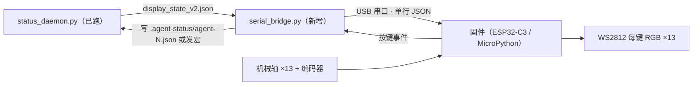

# AgentPad v1 产品规格（2026-08-07 锁定）

> 状态：方案已锁定，进入灯条原型阶段 | 更新：2026-08-07
> 目标：让 v1 软件（通道 B 状态灯，已验收）驱动实体键盘的 RGB，并处理按键。

## 1. 架构（纯 USB，不依赖网络）



- 守护进程已经输出 `display_state_v2.json`（含 6 个 Agent 键状态 + 颜色 + 灯效），
  这一步**不需要改守护进程**，只加一个串口桥 + 固件。
- 串口桥：`serial_bridge.py` 每 100ms 读 display_state_v2.json，差异才下发；
  收到按键事件写回 `.agent-status/agent-N.json`（v1 只预留，按键宏后置）。

## 1.5 布局与屏幕（已锁定）

- **6 个 agent 键**（2×3）：状态灯，紫=thinking / 青=running / 琥珀=waiting /
  绿=done / 红=error / 灰=idle，灯效 solid/breathe/flash 由 PC 下发。
- **7 个命令键**：接受 / 拒绝 / 新建 / 分支 / PTT / 停止 / 重试。
- **1 个 EC11 旋钮**：滚动长输出（v1 先只上报，不做动作）。
- **1.54" IPS 方屏（240×240，SPI，约 ¥12）**：占 2U 槽位，常驻 6 行会话列表
  （槽位号 + 名字 + 颜色点，颜色与灯珠联动）；按 agent 键后切详情页显示会话 summary。
- **槽位规则**：6 槽 = 最近活跃的 6 个会话（LRU）；长按 agent 键钉住（📌）不踢；
  槽位标签 = 会话标题。
- **频道绑定（v0.7.2）**：`channel_map.json` 决定频道 ↔ 对话映射；
  `manual` = 用户手工绑定（`bind_panel.py` 图形面板或手改文件，无需跟 AI 交流），
  `auto` = 守护进程自动分配。手工绑定永不逐出；自动分配首次出现时定槽、之后不挪位。

## 2. 串口协议 v0.1（单行 JSON，UTF-8，LF 结尾）

### 下行（PC → 键盘，灯效）

```json
{"v":1,"seq":42,"ts":1786030000,"keys":[
  {"i":1,"s":"thinking","c":"#9B59FF","e":"breathe"},
  {"i":2,"s":"idle","c":"#555555","e":"off"},
  {"i":6,"s":"done","c":"#22C55E","e":"solid"}
],"cmd":[{"i":1,"label":"接受"},{"i":2,"label":"拒绝"}]}
```

- `keys`：只含变化的 Agent 键（1~6），`e` 枚举：`solid / breathe / flash / off`。
- `cmd`：命令键标签（v1 固定 7 个，宏后置）。
- 固件 ACK：`{"v":1,"ack":42}`，桥未收到 ACK 会重发（最多 3 次）。

### 上行（键盘 → PC，按键）

```json
{"v":1,"ev":"key","i":3}
{"v":1,"ev":"enc","dir":1,"step":1}
```

- `key`：Agent 键 / 命令键按下；`enc`：编码器旋转（v1 先只上报，不做动作）。

## 3. 固件要点（按主控选型后细化）

- **主控：ESP32-C3**（手头已有，MicroPython v1.28 验证通过）。
  实验阶段用开发板 + CP2102 转接（COM5）；成品板用 C3 原生 USB（免 CP2102/免驱动）。
- 灯珠：WS2812/SK6812 ×13（每键一珠，或按板子布线）。
- 扫描：矩阵扫描 13 键 + 编码器，去抖 10ms。
- 串口：实验用 UART0 经 CP2102（115200，单行 JSON）；成品板用原生 USB CDC。
- 灯效：`breathe` 用正弦呼吸，`flash` 用 2Hz 方波，`solid` 常亮，`off` 熄灭。

## 4. 两阶段成本（约）

**阶段 A：灯条原型（用现有开发板，几乎不花钱）**
- 开发板 + WS2812 灯条 ×13（带预焊杜邦线，约 ¥10-20）+ 杜邦线，无需烙铁。

**阶段 B：嘉立创打板（全 SMT 免焊，5 片摊）**

| 部件 | 单台约 |
| --- | --- |
| PCB（5 片摊） | ¥16 |
| ESP32-C3 模组 | ¥15 |
| 轴 + 键帽 ×13 | ¥26 |
| WS2812 ×13（SMT） | ¥10 |
| 1.54" IPS 屏 | ¥12 |
| 旋钮 + 编码器（SMD） | ¥5 |
| USB-C + 小料 | ¥5 |
| 外壳（3D 打印） | ¥20 |
| **合计** | **约 ¥110** |

嘉立创 SMT 基础费按 5 片摊入 PCB/贴装项；所有元件选 SMD，收到即焊好，
只剩插轴、扣键帽、拧螺丝。

## 5. 已确认决策（2026-08-07）

1. 主控：**ESP32-C3**（手头板子；成品板用原生 USB 免 CP2102）。
2. 屏幕：**1.54" IPS 240×240**，占 2U 槽位，约 ¥12。
3. 布局：**6 agent + 7 命令 + 旋钮 + 屏幕**。
4. 打板：嘉立创**全 SMT 免焊**（热插拔轴座 / 灯珠 / 模组 / USB-C 全机贴）。
5. v1 不做的：摇杆、触摸、VIA/Vial、电池（均后置）。
