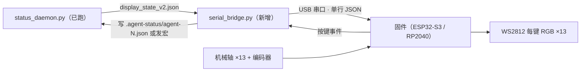

# AgentPad v1 实体硬件接入方案（草案）

> 状态：待硬件选型确认 | 日期：2026-08-07
> 目标：让 v1 软件（通道 B 状态灯，已验收）驱动实体键盘的 RGB，并处理按键。

## 1. 架构（纯 USB，不依赖网络）



- 守护进程已经输出 `display_state_v2.json`（含 6 个 Agent 键状态 + 颜色 + 灯效），
  这一步**不需要改守护进程**，只加一个串口桥 + 固件。
- 串口桥：`serial_bridge.py` 每 100ms 读 display_state_v2.json，差异才下发；
  收到按键事件写回 `.agent-status/agent-N.json`（v1 只预留，按键宏后置）。

## 2. 串口协议 v0.1（单行 JSON，UTF-8，LF 结尾）

### 下行（PC → 键盘，灯效）

```json
{"v":1,"seq":42,"ts":1786030000,"keys":[
  {"i":1,"s":"thinking","c":"#9B59FF","e":"breathe"},
  {"i":2,"s":"idle","c":"#555555","e":"off"},
  {"i":6,"s":"done","c":"#22C55E","e":"solid"}
],"cmd":[{"i":1,"label":"接受"},{"i":2,"label":"拒绝"}]}
```

- `keys`：只含变化的 Agent 键（1~6），`e` 枚举：`solid / breathe / flash / off`。
- `cmd`：命令键标签（v1 固定 7 个，宏后置）。
- 固件 ACK：`{"v":1,"ack":42}`，桥未收到 ACK 会重发（最多 3 次）。

### 上行（键盘 → PC，按键）

```json
{"v":1,"ev":"key","i":3}
{"v":1,"ev":"enc","dir":1,"step":1}
```

- `key`：Agent 键 / 命令键按下；`enc`：编码器旋转（v1 先只上报，不做动作）。

## 3. 固件要点（按主控选型后细化）

- **主控二选一**：
  * ESP32-S3：贵 10~20 元，但自带 USB、以后上 BLE / 通道 A（HID 兼容）不用换板；
  * RP2040：便宜简单，做纯通道 B 够用，但通道 A/BLE 要换板。
- 灯珠：WS2812/SK6812 ×13（每键一珠，或按板子布线）。
- 扫描：矩阵扫描 13 键 + 编码器，去抖 10ms。
- 串口：USB CDC（ESP32-S3 原生 / RP2040 用 TinyUSB），波特率 115200。
- 灯效：`breathe` 用正弦呼吸，`flash` 用 2Hz 方波，`solid` 常亮，`off` 熄灭。

## 4. 手焊/飞线首台方案（省钱优先）

- 免 PCB：洞洞板 + 飞线，13 轴 + 13 灯珠 + 编码器 + 主控开发板。
- 成本：主控 15~25 + 轴 10~20 + 键帽 15~40 + 灯珠 5~10 + 编码器 10~25 + 杂项 ≈ **70~120 元**。
- 外壳：先裸板，跑通后再 3D 打印（5~15 元）。

## 5. 待确认（阻塞项）

1. 主控选哪块？推荐 **ESP32-S3**（为 v2 通道 A / BLE 留路，只贵十几块）。
2. 手头有没有现成板子/轴/灯珠？（有的话按手头的来，省一笔）
3. 键帽有没有偏好（高度/配色）？没有就用通用 OEM 白。
